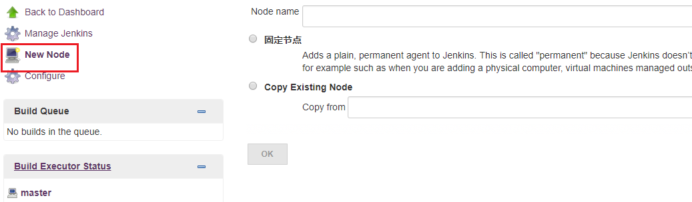
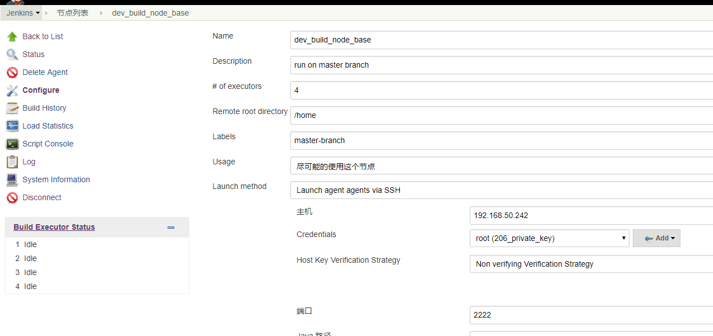
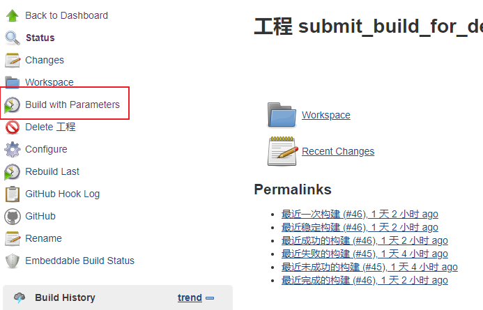
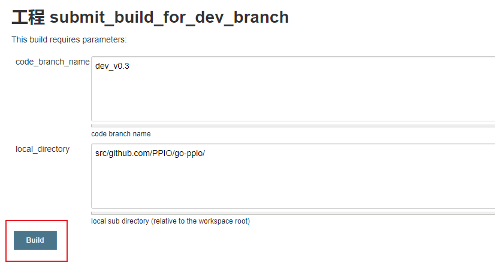
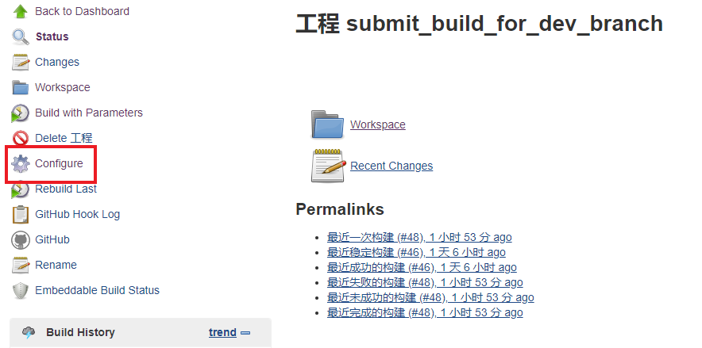
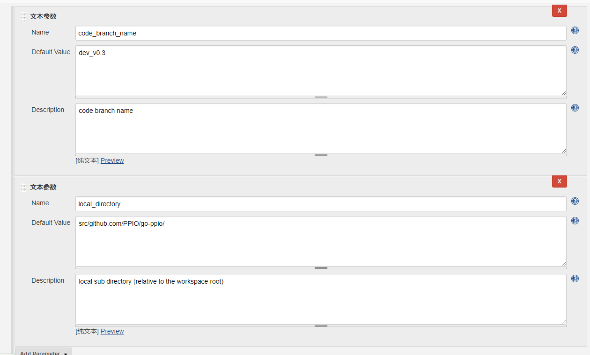
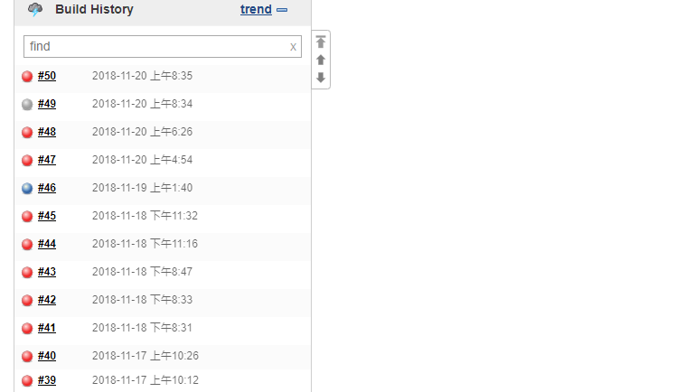
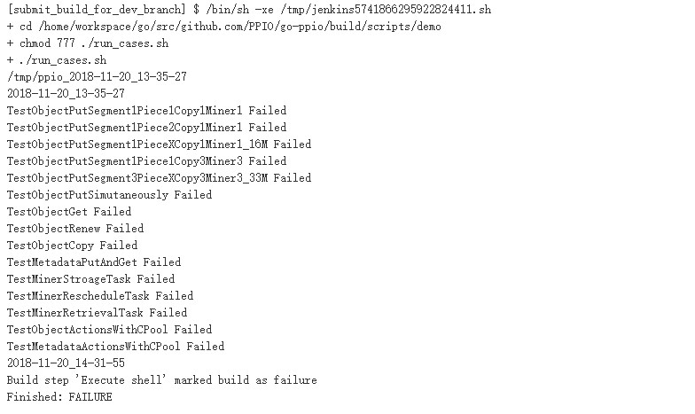

# Single Regnet User Manual
|Author | Ver | Time | Description |
| ----- | --- | -----------| ---------------|
|Qiyu   | 0.1 |2018/10/30  | Initial version|


<!-- TOC -->
<!-- /TOC -->

# 1. 设计目标
1. 开发分支提交构建单机测试环境；
2. 开发个人单机测试环境。

# 2. 测试环境划分
  - __研发人员的VM__
    - 简单VM，centos系统，具体分配见表
[研发VM分配表](https://docs.google.com/spreadsheets/d/1xnyV4w1s6ic3_7AYhX9gAyscru8voG0BYsp4BdeOcRQ)
    - VM中会运行一个DOCKER容器，这个DOCKER容器负责对研发的个人开发分支做自动化测试，测试触发方式暂时为研发手动触发。

# 3. 测试环境搭建

```bash
# 1. 在 /home 目录下，创建 workspace 目录；
> cd /home/
> mkdir workspace
# 2. 下载环境搭建脚本
> git clone git@github.com:PPIO/ppio-tests.git
# 3. 执行环境搭建脚本
> cd /home/workspace/ppio-tests/docs/regnet_single/env_install_shell
> sudo chmod 777 *
> ./install_docker_for_centos.sh
# 该脚本会自动安装 docker 相关环境，下载测试镜像，并设置定时任务，每隔一分钟检查测试容器是否处于运行状态，如果有异常，会重启容器。
```

# 4. Jenkins Slave节点配置（研发不关心）
 1. 打开[节点管理界面](http://192.168.50.206:8080/computer/)；
 2. 点击新建节点按键，填写新建节点名(不可以和已存在节点重名)，选择Copy Existing Node选项，并填写节点名称，点击OK，新节点创建成功；
 
 3. 节点配置注意事项：
   - Launch method: Launch agent agents via SSH；
   - 主机IP需要选择对应执行机的IP地址；
   - Credentials: root (206_private_key)；
   - 高级设置中，端口选择 2222。 
 

# 5. 手动构建方法
  1. 将修改的代码上库；
  2. 进入构建工程页面(如[dev分支构建工程](http://192.168.50.206:8080/view/submit_build/job/submit_build_for_dev_branch/))，点击"Build with Parameters"，进入工程构建页面；

  3. 输入构建分支名称和下载到本地的路径，点击Build按键，触发构建工程；
  
     参数说明：code_branch_name: 构建分支名称，默认值为dev_v0.3；
             local_directory: 代码下载到本地的目录，默认值为src/github.com/PPIO/go-ppio/；
 
  4. 如果需要修改参数默认值，点击工程配置按键，进入工程配置界面，修改对应的文本参数。



# 6. 查看构建结果
  1. 可以从构建历史中，看到某一次构建结果，红色代表失败，蓝色代表成功，黄色代表不稳定，灰色代表被强制暂停；
  2. Build History -> Console Output，可以看到某一次构建的控制台输出，获取构建用例执行结果；
  3. 用例执行输出的log，当前存储于工程对应的执行机中，路径为/home/workspace/test_log。
  
  
  
  
  
  [备注]提交构建的执行机IP: 192.168.50.230；个人构建的执行机IP为研发人员个人VM。
  